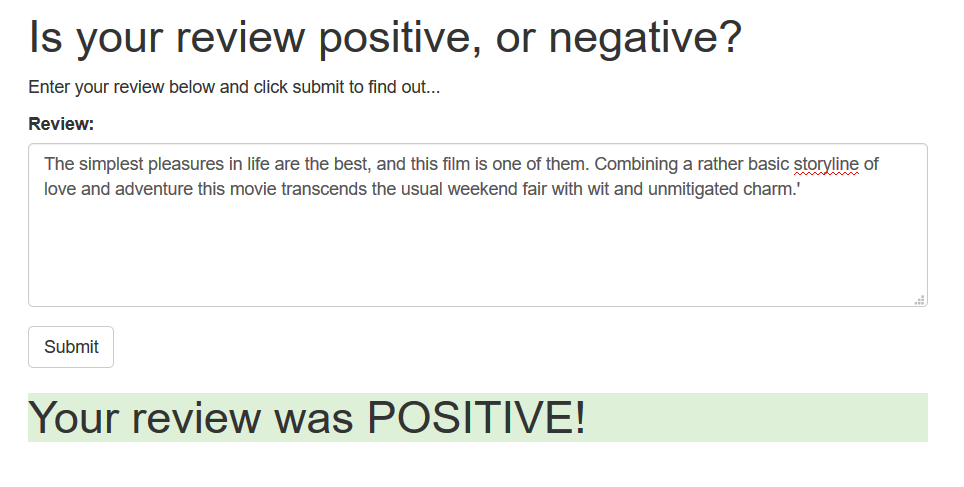

# Sentiment Analysis Deployment - SageMaker Exerciese

This is a simple sentiment analysis deployed on AWS SageMaker.

The output is as below. 
Take a input sentence on webbrowser and return whether the sentiment is "POSITIVE" or "NEGATIVE"  

Note: some additional files are required to run the code. 

